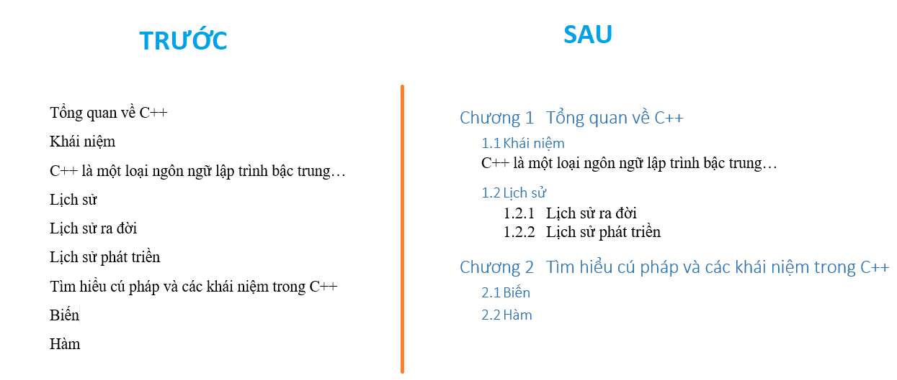
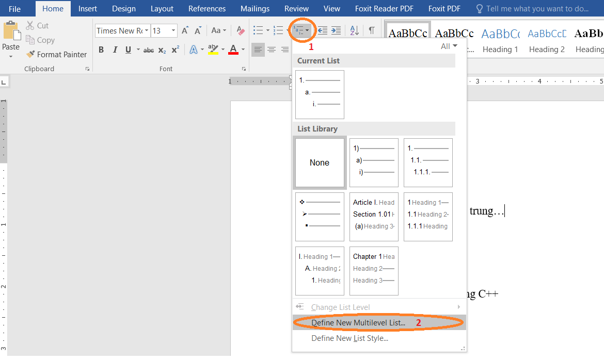
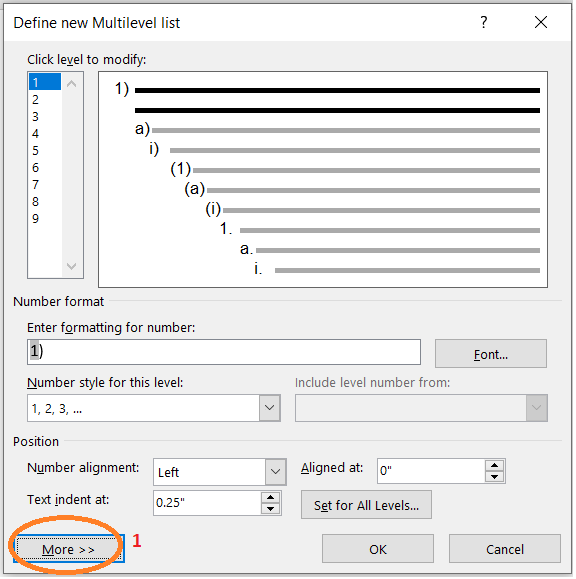
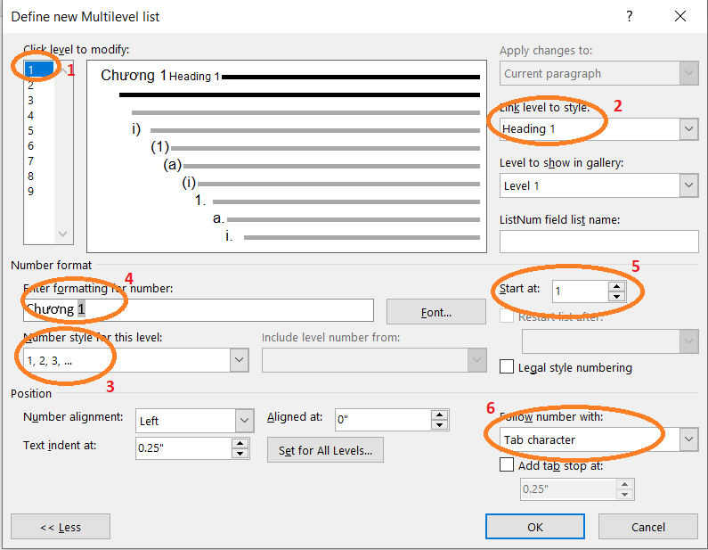
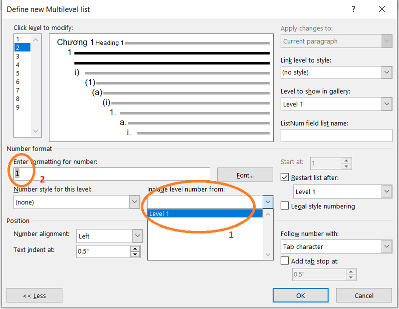
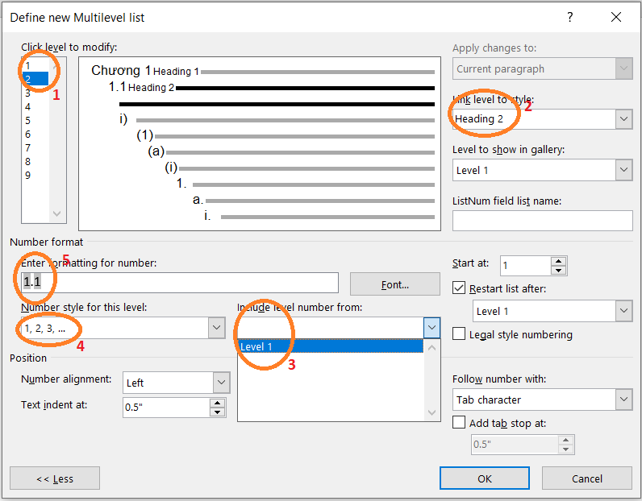
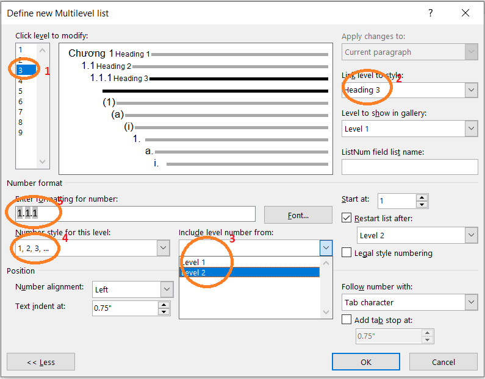
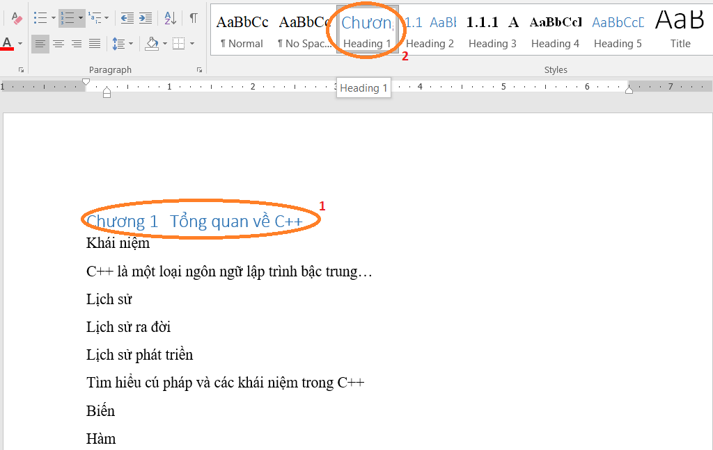
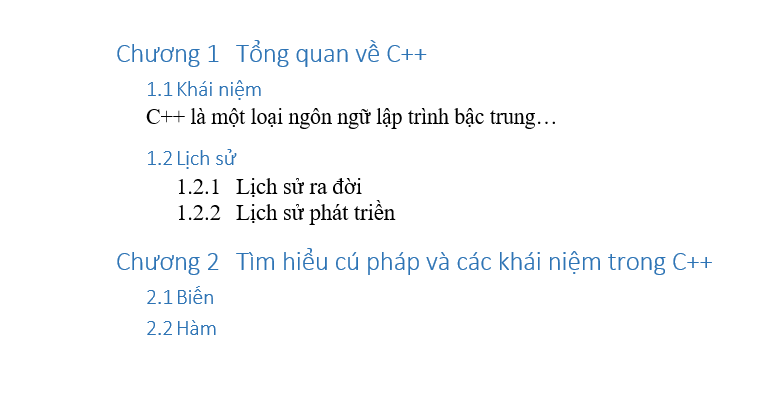

---
title: "Sử dụng Multilevel List để đánh số thứ tự trong Word"
description: "Cách sử dụng Multilevel List để đánh số thứ tự trong Word, tạo mục lục trong Word"
---

>Sự chia sẻ và tình yêu thương là điều quý giá nhất trên đời.

[__Home__][home] | [__Blog__][blog] | [__Diary__][diary] | [__About__][about]

[comment]: (Begin)
# Blog - Sử dụng Multilevel List để đánh số thứ tự trong Word

>_Phát hành: 17/04/2020, bởi Sơn Dương_

## Giới thiệu

Xin chào các bạn! Word chắc không còn xa lạ gì với chúng mình nữa nhỉ? ^^  
Dạo này gần cuối kì rồi nên mình làm khá nhiều báo cáo, và đây là cái mà mình hay quên và phải tìm 
hiểu lại nhất. Để cho nhớ hơn và cũng muốn chia sẻ cho những bạn cũng và đang rơi vào trường hợp như 
mình biết. ^^  
Nói chung, cái này giúp chúng mình đánh số và thuận tiện cho việc tạo mục lục, cũng như nhìn 
cái bài báo dễ _"ăn điểm"_ với thầy cô hơn. hehe  

Ví dụ đây nhé:  

## Nội dung

Mỗi hình ảnh mình sẽ cố gắng nói thật chi tiết nên các bạn chịu khó đọc nhé!  

__(1)__ Các bạn chọn menu Multilevel, sau đó chọn __(2)__ _Define new multilevel list_ để 
định nghĩa một multilevel mới.

Form này xuất hiện các bạn chọn __(1)__ _More>>_ để hiển thị các tùy chọn nâng cao.

Đầu tiên mình sẽ định nghĩ cho level 1 (mức cao nhất).  
Ở mục __(1)__ _level_ các bạn chọn 1.
Ở mục __(2)__ _link level to style_ ở đây mình sẽ sử dụng _heading 1_ làm thằng to nhất, sau 
đó tới các heading sau.  
Ở mục __(3)__ _number style_ thì tùy các bạn muốn chọn kiểu như nào cũng được, ở đây mình 
thích đánh số 1, 2, 3 nên mình chọn.  
Ở mục __(4)__ _formatting_ mặc định nó sẽ chỉ có 1 kí tự mà các bạn chọn, ví dụ ở đây sẽ là __1__, 
do mình muốn nó hiển thị __Chương 1__ nên mình sẽ thêm __Chương__ phía trước nó.  
Ở mục __(5)__ _start at_ là chọn số bạn muốn bắt đầu, nên để nó chạy từ 1. ^^  
Ở mục __(6)__ là khoảng cách từ mục đánh số tới cái nội dung tiêu đề, bạn có thể để mặc định.  

Ok, tiếp tục định nghĩa cho thằng level 2.

Bạn chọn level 2 nhé.  
Đầu tiên ở ô _Formatting for number_ mặc định nó sẽ chèn 1 cái gì đó, bạn hãy xóa trắng ô đó đi, 
sau đó bạn chọn ở __(1)__ _include level_, ở đây là chọn mức phía trước nó. Ví dụ mình muốn hiển 
thị mục con của level 1 là __1.1__ thì mình sẽ chọn thằng level cha của nó trước.  

__(1)__ Chọn level 2.  
__(2)__ Theo thứ tự ở level các bạn chọn _heading 2_.  
__(3)__ Chọn level cha cho nó như ở trên mình đã trình bày.  
__(4)__ Chọn cách hiển thị các bạn muốn.  
__(5)__ Sau khi chọn level cha như ở trên, tự động nó sẽ thêm số `1` vào ô đó, ở đây mình muốn các mức 
phân cách nhau bằng dấu `.` nên mình đã thêm dấu `.` vào giữ 2 mức như hình. Các bạn có thể chèn 
kí hiệu tùy ý.

Ok, tiếp tục với level 3, 4, 5... các bạn cứ lần lượt làm như vậy. Chú ý lúc __include level__ nhé, 
nhớ là cứ lần lượt chọn theo level cha của nó (level cấp cao hơn nó).  
Đây là level mức 3 sau khi mình định nghĩa:  

Chỗ _include level_ chọn lần lượt nhé, mình vẫn phân cách là dấu `.` đó. ^^  

Sau khi đã định nghĩa các cấp mình cần, các bạn bấm `OK` để lưu lại.  
Bây giờ dùng thôi. :D

__(1)__ Bạn chọn dòng cần thiết lập mức level.  
__(2)__ Sau đó bạn chọn _Heading 1_ trên thanh công cụ, thế là được.  

Tương tự với các level khác, và đây là kết quả sau khi hoàn thành.  

Xong! Cũng được đấy nhỉ, màu mè mình để mặc định nhá, bạn có thể chỉnh theo ý mình nha. ^^  

### Kết luận

Vậy là mình và các bạn đã tìm hiểu cách sử dụng __Multilevel List__ trong Word. Cảm ơn các bạn đã 
đọc bài viết của mình. <3  
Có thắc mắc hay ý kiến đóng góp vui lòng bình luận bên dưới giúp mình nhé!  
Cảm ơn bạn, chúc bạn thành công!

[comment]: (End)

[__Back to Blog?__](https://duongvanson.github.io/blog "Trở lại đâu đấy???")

> Follow me: [Facebook][fb] , [Instagram][ins] , [Youtube][yt]

## Bình luận

###### __&copy; duongsondev__

[home]: https://duongvanson.github.io "Home"
[blog]: https://duongvanson.github.io/blog "Blog"
[diary]: https://duongvanson.github.io/diary "Diary"
[about]: https://duongvanson.github.io/about "About"
[fb]: https://www.facebook.com/duongson3198 "Facebook"
[ins]: https://www.instagram.com/duongson98/ "Instagram"
[yt]: https://www.youtube.com/channel/UCu382PQhF-gds6lzmYQgYPQ "Youtube"